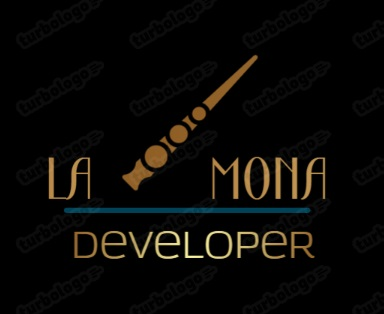

  

# La Mona Developer

**Repositorio para prácticas de estudio y mejora continua**  
Este espacio está dedicado al aprendizaje, desarrollo y mejora de habilidades de programación, con ejercicios prácticos, proyectos personales y desafíos de estudio.

---

## 📚 Índice de Repositorios

A continuación se listan los distintos proyectos/prácticas disponibles o en desarrollo dentro de este repositorio principal:

| Proyecto | Descripción |
|----------|-------------|
| [itecsurmonica1](https://github.com/monicarea-hint/itecsurmonica1) | Repositorio principal de prácticas para ITECSUR. Incluye ejercicios introductorios y desarrollo progresivo en programación. |
| [Otro repositorio futuro](#) | *(Aquí puedes agregar enlaces a otros repositorios a medida que los crees)* |

---

## 🔧 Objetivo

- Reforzar conocimientos teóricos mediante la práctica.
- Aplicar principios de desarrollo con enfoque educativo.
- Crear un portafolio que refleje la evolución del aprendizaje.

---

## 🧠 Filosofía

> “El conocimiento se construye paso a paso, y cada línea de código es un ladrillo en el camino del desarrollo.”

---

## 📩 Contacto

Si deseas colaborar, compartir ideas o sugerencias:
- **GitHub:** [monicarea-hint](https://github.com/monicarea-hint)

---

**© 2025 La Mona Developer. Todos los derechos reservados.**
